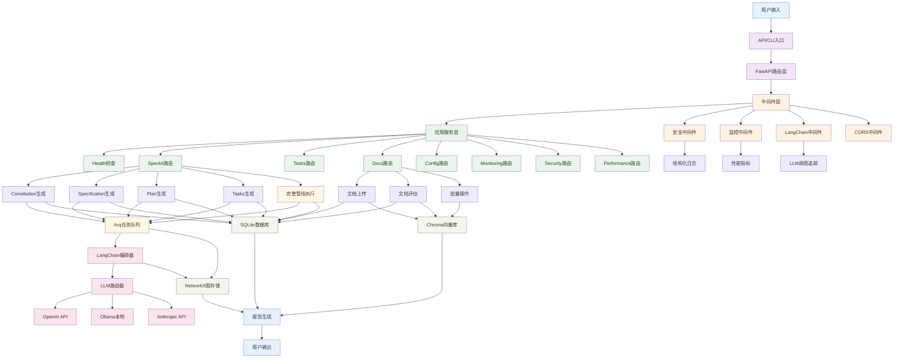
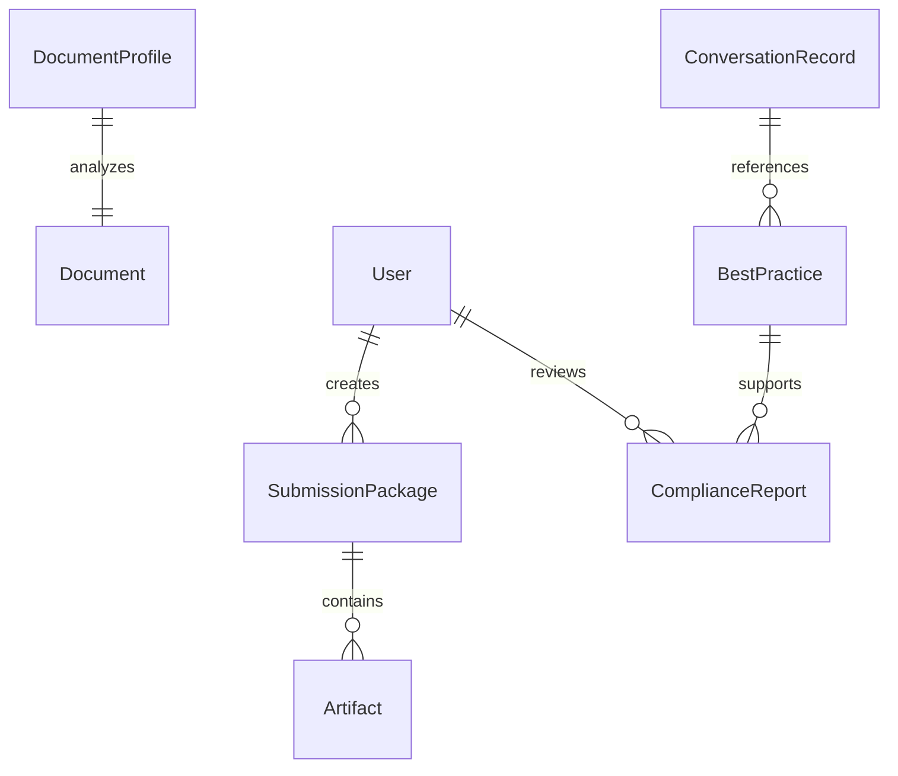

<!-- generated: cli:docs meta-inject @ 2025-11-19T13:30:15Z -->
<!-- classification: developer -->

# 系统架构设计

## 概述

本文档描述了 lumoscribe2033 Hybrid Graph-RAG Phase 1 质量平台的系统架构设计，包括核心组件、数据流和集成方式。架构遵循简单性、反抽象、集成优先原则，确保系统的可维护性和扩展性。

## 架构原则

基于 speckit 最佳实践和 2025-11-17 重构经验，本系统遵循以下架构原则：

### 简单性原则 (Simplicity Gate)
- 使用 ≤3 个主要项目结构：API服务、CLI工具、后台任务
- 避免过度工程化，直接使用框架功能
- 单文件代码量 <4000 行

### 反抽象原则 (Anti-Abstraction Gate)
- 直接使用 LangChain 1.0、FastAPI、Arq 等框架
- 单一模型表示，避免多层抽象
- 统一的数据模型和接口设计

### 集成优先原则 (Integration-First Gate)
- 优先使用真实数据库而非模拟数据
- 实际服务实例而非存根
- 合同测试在实现之前编写

### 架构质量原则 (Architecture Quality Gate) - 2025-11-17 新增
- **DRY 原则**: 代码重复度 <5%，重复代码必须提取为可复用组件
- **SOLID 原则**: 
  - 单一职责：每个类只负责一个功能领域
  - 开闭原则：通过设计模式实现扩展，而非修改现有代码
  - 依赖倒置：依赖抽象接口而非具体实现
- **设计模式应用**: 策略模式（检索策略）、适配器模式（存储接口）、工厂模式（对象创建）、组合模式（组件组合）
- **接口统一**: 同一功能的不同实现通过统一接口暴露
- 详细指南: `docs/reference/architecture-quality-guide.md`

## 系统架构图

```
┌─────────────────────────────────────────────────────────────────────────────────┐
│                              用户界面层                                          │
├─────────────────────────────────────────────────────────────────────────────────┤
│  ┌─────────────┐  ┌─────────────┐  ┌─────────────┐  ┌─────────────┐            │
│  │   CLI工具    │  │   Web API    │  │    MCP      │  │  IDE适配器    │            │
│  │             │  │             │  │             │  │             │            │
│  │ • run-pipe  │  │ • /pipeline │  │ • speckit   │  │ • .cursor/  │            │
│  │ • gen-ide   │  │ • /docs     │  │ • analysis  │  │ • .roo/     │            │
│  │ • eval-docs │  │ • /compliance│ │ • tasks     │  │ • agents.md │            │
│  └─────────────┘  └─────────────┘  └─────────────┘  └─────────────┘            │
└─────────────────────────────────────────────────────────────────────────────────┘
                              │                        │
                              │                        │
                              ▼                        ▼
┌─────────────────────────────────────────────────────────────────────────────────┐
│                            应用服务层                                            │
├─────────────────────────────────────────────────────────────────────────────────┤
│  ┌─────────────┐  ┌─────────────┐  ┌─────────────┐  ┌─────────────┐            │
│  │  Pipeline   │  │  Document   │  │ Compliance  │  │  Knowledge   │            │
│  │  Domain     │  │   Review     │  │   Domain    │  │   Domain     │            │
│  │             │  │             │  │             │  │             │            │
│  │ • speckit   │  │ • classify  │  │ • static    │  │ • best      │            │
│  │   executor  │  │ • evaluate  │  │   check     │  │   practice  │            │
│  │ • metadata  │  │ • profiling │  │ • trace     │  │ • conv      │            │
│  │   inject    │  │             │  │             │  │   ingest    │            │
│  └─────────────┘  └─────────────┘  └─────────────┘  └─────────────┘            │
└─────────────────────────────────────────────────────────────────────────────────┘
                              │                        │
                              │                        │
                              ▼                        ▼
┌─────────────────────────────────────────────────────────────────────────────────┐
│                            框架层                                                │
├─────────────────────────────────────────────────────────────────────────────────┤
│  ┌─────────────┐  ┌─────────────┐  ┌─────────────┐  ┌─────────────┐            │
│  │  LangChain  │  │  LLM Router │  │   Storage   │  │  Adapters   │            │
│  │  Orchestrator│  │             │  │   Layer     │  │   Layer     │            │
│  │             │  │             │  │             │  │             │            │
│  │ • chain     │  │ • routing   │  │ • SQLite    │  │ • IDE       │            │
│  │ • router    │  │ • adaptive  │  │ • Chroma    │  │ • Conv      │            │
│  │ • agent     │  │ • fallback  │  │ • NetworkX  │  │ • Config    │            │
│  │             │  │             │  │             │  │ • LLM       │            │
│  └─────────────┘  └─────────────┘  └─────────────┘  └─────────────┘            │
└─────────────────────────────────────────────────────────────────────────────────┘
                              │                        │
                              │                        │
                              ▼                        ▼
┌─────────────────────────────────────────────────────────────────────────────────┐
│                            基础设施层                                            │
├─────────────────────────────────────────────────────────────────────────────────┤
│  ┌─────────────┐  ┌─────────────┐  ┌─────────────┐  ┌─────────────┐            │
│  │    FastAPI  │  │     Arq     │  │  Background │  │   Logging & │            │
│  │             │  │             │  │   Tasks     │  │   Monitoring  │            │
│  │ • routes    │  │ • tasks     │  │ • async     │  │ • structlog │            │
│  │ • middleware│  │ • lifecycle │  │ • queue     │  │ • telemetry │            │
│  │ • version   │  │ • settings  │  │ • error     │  │ • metrics   │            │
│  │ • docs      │  │ • workers   │  │ • retry     │  │ • tracing   │            │
│  └─────────────┘  └─────────────┘  └─────────────┘  └─────────────┘            │
└─────────────────────────────────────────────────────────────────────────────────┘
                              │                        │
                              │                        │
                              ▼                        ▼
┌─────────────────────────────────────────────────────────────────────────────────┐
│                            数据存储层                                            │
├─────────────────────────────────────────────────────────────────────────────────┤
│  ┌─────────────┐  ┌─────────────┐  ┌─────────────┐  ┌─────────────┐            │
│  │   SQLite    │  │   Chroma    │  │  NetworkX   │  │   Filesystem│            │
│  │             │  │             │  │             │  │             │            │
│  │ • jobs      │  │ • vectors   │  │ • graph     │  │ • configs   │            │
│  │ • metadata  │  │ • embeddings│  │ • topology  │  │ • logs      │            │
│  │ • reports   │  │ • indexes   │  │ • snapshots │  │ • artifacts │            │
│  │             │  │             │  │             │  │             │            │
│  └─────────────┘  └─────────────┘  └─────────────┘  └─────────────┘            │
└─────────────────────────────────────────────────────────────────────────────────┘

## 核心组件详解

### 1. 应用服务层 (Application Layer)

#### Pipeline Domain ([`src/domain/pipeline/`](src/domain/pipeline/))
负责 speckit 全流程自动化和任务编排：

```python
# 核心流程模型
class SubmissionPackage(BaseModel):
    id: str
    source_path: str
    uploader: str
    submitted_at: datetime
    status: SubmissionStatus
    speckit_log_path: str
    retry_of: Optional[str] = None

# 执行流程
SubmissionPackage -> speckit.constitution -> specify -> plan -> tasks -> ComplianceReport
```

**主要功能：**
- 自然语言文档解析和 ingestion ([`src/domain/pipeline/models.py`](src/domain/pipeline/models.py))
- 串行执行 speckit 四大命令
- 作业状态跟踪和管理
- 元数据注入和验证 ([`src/framework/shared/metadata_injector.py`](src/framework/shared/metadata_injector.py))

#### Document Review Domain ([`src/domain/doc_review/`](src/domain/doc_review/))
实现文档三分法评估和质量检查：

```python
# 文档分类和评估流程
class DocumentProfile(BaseModel):
    id: str
    file_path: str
    doc_type: DocumentType  # agent/developer/external
    token_count: int
    structure_score: float
    style_findings: List[str]
    last_reviewed_at: datetime

# 评估流程
Document -> classify(Agent/Dev/External) -> evaluate(structure/style) -> DocumentProfile
```

**主要功能：**
- 文档自动分类（Agent/Developer/External）([`src/domain/doc_review/classifier.py`](src/domain/doc_review/classifier.py))
- 针对 Agent 文档的 token 消耗分析
- 结构和风格评估 ([`src/domain/doc_review/classifier_enhanced.py`](src/domain/doc_review/classifier_enhanced.py))
- 整改建议生成和质量评分

#### Compliance Domain ([`src/domain/compliance/`](src/domain/compliance/))
提供静态检查和追溯能力：

```python
# 合规检查流程
class ComplianceReport(BaseModel):
    id: str
    submission_id: str
    generated_at: datetime
    static_checks: List[StaticCheckResult]
    doc_findings: List[DocFinding]
    traceability_gaps: List[TraceabilityGap]
    status: ComplianceStatus

# 检查流程
Code/Docs -> static_check(Ruff/Mypy/ESLint) -> traceability_analysis -> ComplianceReport
```

**主要功能：**
- 代码静态检查集成 ([`src/domain/compliance/models.py`](src/domain/compliance/models.py))
- 文档合规性验证
- Spec-to-Code 追溯分析 ([`src/domain/compliance/traceability.py`](src/domain/compliance/traceability.py))
- 告警与对话记录关联

#### Knowledge Domain ([`src/domain/knowledge/`](src/domain/knowledge/))
管理最佳实践和对话溯源：

```python
# 知识管理流程
class ConversationRecord(BaseModel):
    id: str
    source: str  # cursor, roocode, manual
    content: str
    timestamp: datetime
    embedding: List[float]
    related_tasks: List[str]

# 管理流程
Conversation -> ingest -> embed -> vector_store + graph_store -> search/retrieve
```

**主要功能：**
- IDE 对话自动导入和解析 ([`src/domain/knowledge/models.py`](src/domain/knowledge/models.py))
- 最佳实践库管理
- 向量和图存储集成
- 语义检索和关联分析

### 2. 框架层 (Framework Layer)

#### FastAPI 应用框架
基于 FastAPI 的高性能 Web 框架：

```python
# 应用配置示例
app = FastAPI(
    title="lumoscribe2033 Hybrid Graph-RAG API",
    description="基于 speckit 的 AI 驱动质量提升平台",
    version="0.1.0",
    docs_url="/docs",
    redoc_url="/redoc",
    lifespan=lifespan,
    openapi_url="/openapi.json"
)
```

**核心特性：**
- 异步支持和高性能
- 自动 API 文档生成（Swagger UI + ReDoc）
- 类型安全的请求/响应模型
- 统一的异常处理机制
- 内置的数据验证（Pydantic）

#### 中间件层 (Middleware Layer)
多层中间件架构提供安全、监控和功能增强：

```python
# 中间件配置顺序
1. 安全中间件 (SecurityMiddleware)
   - 认证和授权
   - 输入验证和清理
   - 速率限制
   - CORS 处理

2. 监控中间件 (EnhancedMonitoringMiddleware)
   - 请求/响应日志
   - 性能指标收集
   - 错误追踪
   - 断路器保护

3. LangChain 中间件 (LangChainMiddleware)
   - LLM 调用追踪
   - 安全审计
   - 输入/输出处理
   - 成本监控

4. 基础中间件
   - 请求日志记录
   - 处理时间头
   - 安全头添加
   - CORS 支持
```

#### LangChain 编排层
基于 LangChain 1.0 的智能任务编排：

```python
# 编排器初始化
from src.framework.orchestrators import bootstrap_langchain_executor

# 支持的执行模式
class ExecutionMode:
    CONSTITUTION_GENERATION = "constitution"
    SPECIFICATION_GENERATION = "specification"
    PLAN_GENERATION = "plan"
    TASKS_GENERATION = "tasks"
    FULL_PIPELINE = "full_pipeline"
```

**核心功能：**
- 串行执行 speckit 四大命令
- 动态任务调度和管理
- 错误处理和重试机制
- 执行进度跟踪和报告

#### LLM 路由系统
智能的多模型路由和管理：

```python
# 路由策略配置
class RoutingConfig:
    PRIMARY_MODEL = "gpt-4o-mini"      # 主要模型
    FALLBACK_MODELS = ["gpt-3.5-turbo", "claude-3-sonnet"]
    LOCAL_MODEL = "llama2"             # 本地模型
    COST_THRESHOLD = 0.01              # 成本阈值
    PERFORMANCE_WEIGHT = 0.7           # 性能权重
```

**支持的模型：**
- **OpenAI**: GPT-4o, GPT-4o-mini, GPT-3.5-turbo
- **Anthropic**: Claude 3 系列
- **本地模型**: Ollama 支持的各类模型
- **自定义 API**: 支持 OpenAI 兼容接口

#### 存储抽象层 (Storage Layer)
统一的数据存储接口和实现：

```python
# 存储接口定义
class StorageInterface:
    def save(self, entity): pass
    def load(self, entity_id): pass
    def query(self, filter): pass
    def delete(self, entity_id): pass
    def batch_operation(self, operations): pass
```

**存储组件：**
- **SQLite Gateway** ([`src/framework/storage/sqlite_gateway.py`](src/framework/storage/sqlite_gateway.py)): 结构化数据存储，支持 Jobs、Metadata、Reports
- **Vector Store** ([`src/framework/storage/vector_store.py`](src/framework/storage/vector_store.py)): 向量嵌入和相似度搜索，基于 Chroma
- **Enhanced Vector Store** ([`src/framework/storage/enhanced_vector_store.py`](src/framework/storage/enhanced_vector_store.py)): 增强的向量存储功能
- **Graph Store** ([`src/framework/storage/enhanced_graph_store.py`](src/framework/storage/enhanced_graph_store.py)): 知识图谱和关系存储，基于 NetworkX

#### 适配器层 (Adapters Layer)
统一的适配器接口和工厂模式：

```python
# 适配器工厂
class AdapterFactory:
    def register_adapter(self, name, adapter_class, metadata): pass
    def create_adapter(self, name, **kwargs): pass
    def list_adapters(self, adapter_type=None, tag=None): pass
    def get_adapter_info(self, name): pass
```

**适配器类型：**
- **IDE Adapters** ([`src/framework/adapters/ide_adapter.py`](src/framework/adapters/ide_adapter.py)): Cursor、RooCode 等 IDE 集成
- **Conversation Adapters** ([`src/framework/adapters/conversation_adapter.py`](src/framework/adapters/conversation_adapter.py)): 对话日志解析和导入
- **Config Adapters** ([`src/framework/adapters/config_adapter.py`](src/framework/adapters/config_adapter.py)): 配置文件管理和验证
- **LLM Adapters** ([`src/framework/adapters/llm_adapter.py`](src/framework/adapters/llm_adapter.py)): 大语言模型接口抽象
- **LLM Router Adapter** ([`src/framework/adapters/llm_router_adapter.py`](src/framework/adapters/llm_router_adapter.py)): 智能路由适配器

### 3. 数据流图



### 4. 关键数据模型

#### SubmissionPackage
```python
{
    "id": "uuid",
    "source_path": "/path/to/doc.md",
    "uploader": "user",
    "submitted_at": "2025-11-16T10:42:34Z",
    "status": "succeeded",
    "speckit_log_path": "/path/to/log.txt",
    "retry_of": null
}
```

#### DocumentProfile
```python
{
    "id": "uuid",
    "file_path": "/specs/feature/spec.md",
    "doc_type": "agent",  # agent/developer/external
    "token_count": 1500,
    "structure_score": 85,
    "style_findings": [...],
    "last_reviewed_at": "2025-11-16T10:42:34Z"
}
```

#### ComplianceReport
```python
{
    "id": "uuid",
    "submission_id": "uuid",
    "generated_at": "2025-11-16T10:42:34Z",
    "static_checks": [...],
    "doc_findings": [...],
    "traceability_gaps": [...],
    "status": "pass"
}
```

### 5. 性能和扩展性

#### 性能目标
- **Speckit Pipeline**: 单次运行 ≤10 分钟（50页文档）
- **文档评估**: 一次覆盖 ≥20 个文件
- **CLI 响应**: ≤3 秒
- **IDE 适配包生成**: ≤30 秒

#### 扩展能力
- **并发支持**: 5个并行 speckit 作业
- **存储容量**: 10k+ 对话记录，100+ 最佳实践
- **模型扩展**: 支持新增 LLM 供应商
- **IDE 扩展**: 支持新增 IDE 类型

### 6. 部署架构

#### 开发环境
```bash
# 推荐配置
conda activate lumoscribe2033
uvicorn src.api.main:app --reload --port 8080
arq workers.settings.WorkerSettings
```

#### 生产环境
```bash
# 无 Conda 部署
python -m uv venv
uv pip install -e .
gunicorn src.api.main:app -w 4 -k uvicorn.workers.UvicornWorker
arq workers.settings.WorkerSettings
```

#### 监控和日志
- **结构化日志**: 使用 structlog 统一格式 ([`src/framework/shared/logging.py`](src/framework/shared/logging.py))
- **性能监控**: OpenTelemetry 集成 ([`src/framework/shared/monitoring.py`](src/framework/shared/monitoring.py))
- **错误追踪**: Sentry 或类似服务 ([`src/framework/shared/error_handler.py`](src/framework/shared/error_handler.py))
- **指标收集**: Prometheus + Grafana ([`src/framework/shared/telemetry.py`](src/framework/shared/telemetry.py))
- **增强监控中间件**: 请求追踪和性能分析 ([`src/api/monitoring_middleware.py`](src/api/monitoring_middleware.py))
- **安全审计**: 安全事件记录和分析 ([`src/framework/shared/security.py`](src/framework/shared/security.py))

## 架构验证

本架构符合 speckit 最佳实践：

### ✅ 简单性验证
- 单一仓库，清晰的模块分离
- 直接使用成熟框架，避免重复造轮子
- 文件大小控制在合理范围内

### ✅ 反抽象验证
- LangChain 1.0 直接集成
- FastAPI 原生功能使用
- SQLModel 统一数据访问

### ✅ 集成优先验证
- 真实数据库集成（SQLite、Chroma）
- 实际 LLM API 调用
- 真实 IDE 文件结构生成

该架构为 Phase 1 功能提供了坚实基础，并为后续扩展预留了充足空间。

## 数据模型

### 核心实体

#### SubmissionPackage
```python
class SubmissionPackage(BaseModel):
    id: str
    content: str
    author: str
    timestamp: datetime
    status: SubmissionStatus
    artifacts: List[Artifact]
```

#### DocumentProfile
```python
class DocumentProfile(BaseModel):
    id: str
    file_path: str
    doc_type: DocumentType  # Agent/Developer/External
    structure_score: float
    token_count: int
    recommendations: List[str]
```

#### ConversationRecord
```python
class ConversationRecord(BaseModel):
    id: str
    source: str  # cursor, roocode, manual
    content: str
    timestamp: datetime
    embedding: List[float]
    related_tasks: List[str]
```

### 关系模型



## API 接口

### 核心 API 端点

#### 健康检查 (Health)
- `GET /api/v1/health` - 系统健康状态检查
- `GET /ready` - 就绪检查（Kubernetes 探针）
- `GET /live` - 存活检查（Kubernetes 探针）
- `GET /version` - 获取版本信息
- `GET /metrics` - 获取系统指标

#### Speckit 管理
- `POST /api/v1/speckit/constitution` - 生成 Constitution 文档
- `POST /api/v1/speckit/specify` - 生成 Specification 文档
- `POST /api/v1/speckit/plan` - 生成 Project Plan 文档
- `POST /api/v1/speckit/tasks` - 生成 Tasks 文档
- `POST /api/v1/speckit/full-pipeline` - 运行完整 Speckit 管线
- `GET /api/v1/speckit/status/{pipeline_id}` - 查询管线执行状态
- `POST /api/v1/speckit/upload` - 上传文档并自动生成 Speckit 工件
- `GET /api/v1/speckit/templates` - 获取可用的模板列表

#### 任务管理 (Tasks)
- `GET /api/v1/tasks/queue/status` - 获取任务队列状态
- `POST /api/v1/tasks/queue/push` - 提交新任务到队列
- `GET /api/v1/tasks/{task_id}` - 查询任务执行状态
- `GET /api/v1/tasks` - 列出任务（支持分页和过滤）
- `DELETE /api/v1/tasks/{task_id}` - 取消任务
- `POST /api/v1/tasks/{task_id}/retry` - 重试任务
- `GET /api/v1/tasks/stats` - 获取任务统计信息

#### 文档管理 (Documents)
- `POST /api/v1/docs/upload` - 上传文档（支持自动评估）
- `GET /api/v1/docs/{document_id}` - 获取文档详细信息
- `GET /api/v1/docs` - 列出文档（支持分页和过滤）
- `POST /api/v1/docs/{document_id}/evaluate` - 评估文档质量
- `DELETE /api/v1/docs/{document_id}` - 删除文档
- `POST /api/v1/docs/batch` - 批量操作文档
- `GET /api/v1/docs/stats` - 获取文档统计信息
- `GET /api/v1/docs/export/{document_id}` - 导出文档

#### 配置管理 (Config)
- `GET /api/v1/config/settings` - 获取系统配置
- `POST /api/v1/config/settings` - 更新系统配置
- `GET /api/v1/config/validate` - 验证配置有效性

#### 监控管理 (Monitoring)
- `GET /monitoring/status` - 获取监控状态
- `POST /monitoring/config` - 更新监控配置
- `GET /monitoring/alerts` - 获取告警信息

#### 安全管理 (Security)
- `GET /security/scan` - 执行安全扫描
- `POST /security/audit` - 安全审计
- `GET /security/logs` - 获取安全日志

#### 性能监控 (Performance)
- `GET /api/v1/performance/metrics` - 获取性能指标
- `GET /api/v1/performance/bottlenecks` - 获取性能瓶颈分析
- `POST /api/v1/performance/optimize` - 性能优化建议

### 请求/响应格式

#### 统一响应格式
```json
{
  "success": true,
  "data": {},
  "message": "操作成功",
  "timestamp": "2025-11-19T12:59:00Z"
}
```

#### 错误响应格式
```json
{
  "success": false,
  "error": {
    "code": "VALIDATION_ERROR",
    "message": "参数验证失败",
    "details": {
      "field": "document_type",
      "value": "invalid",
      "expected": ["agent", "developer", "external"]
    }
  },
  "timestamp": "2025-11-19T12:59:00Z"
}
```